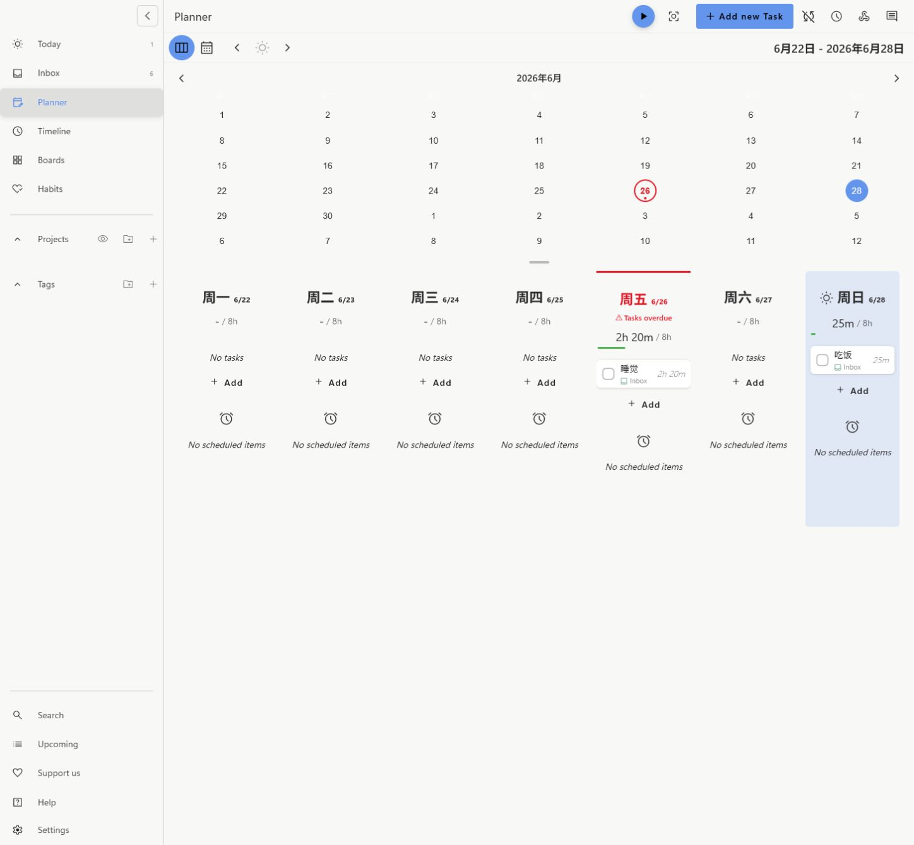

# Super Productivity Desktop Plan

首先感谢 [Super Productivity 官方项目](https://github.com/super-productivity/super-productivity)、
原作者 Johannes Millan 以及所有贡献者提供的优秀开源基础。本项目基于其 MIT
许可源码开发，保留原始版权与许可证声明。

这是面向 Windows 桌面规划场景的非官方独立衍生版，重点补充桌面艾森豪威尔矩阵、
可区分规划与实际记录的时间表，以及可自定义的全局/小组件背景。它不会继续自动合并
上游更新，后续版本以本仓库的稳定性和既有工作流为主。

> [!IMPORTANT]
> 本项目不是 Super Productivity 官方发行版。请勿向官方仓库反馈本衍生版独有问题。
> Git 仓库不包含用户数据、备份或私人图片；Windows 安装包通过本仓库 Releases 发布。

## 界面预览

  

规划表周视图：周一至周日、月历联动、当天高亮与逾期提示。

## 下载安装

在 [Releases](https://github.com/larryheng/super-productivity-desktop-plan/releases)
下载 Windows x64 安装包。安装目录可以自行选择，推荐把程序放在非系统盘。

当前社区安装包未使用商业代码签名证书，Windows 可能显示“未知发布者”提示；源码、
构建脚本和每个 Release 的安装包都可在本仓库核对。

## 主要不同

### 桌面任务小组件

- 复用应用内的艾森豪威尔矩阵，任务状态、倒计时和 DONE 与主程序双向同步。
- 小组件位于桌面层，普通软件窗口会覆盖它；Windows“显示桌面”后会自动恢复。
- 支持拖动、缩放、尺寸下限、位置记忆、暂停/继续和到时延长。
- DONE 后先置灰保留；每日结算仅移除已完成任务的 Urgent/Important 标签，不归档历史。
- 小组件可以使用主题色、继承全局背景或使用独立背景，并单独调整背景与内容可见度。

### 时间表与规划表

- “时间表”展示真实计时记录；实际块不可拖动，规划参考块仍可拖动并在冲突时顺延。
- 周视图固定为周一至周日，支持历史周、当天高亮、实时当前时间线和“回到今天”。
- 同一任务的相邻实际块按用户设置的 `0–30` 分钟间隔自动合并。
- 时间表月视图实时汇总每日总时长和每项任务时长，点击日期可跳转到对应周。
- 规划表保留可编辑的待做安排，并新增同模板月视图，只枚举内容、不伪装成实际时长。
- 午休允许规划任务跨越，并按过渡规则拆分展示；事件冲突时后续规划整体顺延。

### 空闲记录、中文与每日结算

- 空闲弹窗可以选择已有任务或新建任务，并把完整空闲区间补记为实际记录。
- 手动“结束这一天”和默认凌晨 `04:00` 自动结算使用同一逻辑日边界。
- 补齐简体中文翻译，包括休息提醒、空闲处理和本定制版新增界面。

### 背景与存储

- 全局背景与小组件背景都支持点击图片选择焦点；窗口缩放或 `cover` 裁切时保留该位置。
- 两处图片入口统一显示程序实际读取的受管副本路径，不再暴露 `image:<id>` 给用户。
- 选择图片时只复制文件，原始图片不移动、不删除。
- 背景图片存储目录可以自行选择；变更时会迁移现有受管副本，失败则保留旧配置。
- 本地备份目录也可自行选择，已有备份会迁移，默认应用路径通过兼容链接继续可用。

推荐的数据分布：

- 程序本体：安装时选择，例如 `D:\DevelopTools\Super Productivity`。
- 备份：设置中选择，例如 `F:\Documents\superProductivity\backups`。
- 背景副本：设置中选择，例如 `F:\Documents\superProductivity\bg-images`。
- C 盘用户目录：只保留小体量配置、日志和运行状态。

更多实现说明与验证命令见
[定制版开发说明](docs/plans/custom-desktop-widget-publishing-prep.md)。

---

## 上游项目说明

  <strong>
    An advanced todo list app with timeboxing & time tracking capabilities that supports importing tasks from your calendar, Jira, GitHub and others
  </strong>

  :globe_with_meridians: <a href="https://app.super-productivity.com">Open Web App</a> or :computer: <a href="https://github.com/super-productivity/super-productivity/wiki/2.01-Downloads-and-Install">Download</a>

 

<!-- The <a> and  elements are intentionally made without space.
     Because of the extra whitespace characters in <a>, makes blue underline lines appear for them.
     Please do not change this formatting, so as not to make them.
-->

  
  &nbsp;
  

  
  &nbsp;
  
  &nbsp;
  

  

## :computer: Downloads & Install

  
  
  
  
  
  
  

  <strong>For all current downloads, package links, and platform-specific notes:
    <a href="https://github.com/super-productivity/super-productivity/wiki/2.01-Downloads-and-Install" target="_blank">
      check the wiki
    </a>
  </strong> 
  

  <a href="https://bank.gov.ua/en/news/all/natsionalniy-bank-vidkriv-rahunok-dlya-gumanitarnoyi-dopomogi-ukrayintsyam-postrajdalim-vid-rosiyskoyi-agresiyi" target="_blank">
     
    <strong>Humanitarian Aid for Ukraine</strong> 
    Support humanitarian relief via the official National Bank of Ukraine account.
  </a>

## :heavy_check_mark: Features

- **Keep organized and focused!** Plan and categorize your tasks using sub-tasks, projects and tags and color code them as needed.
- Use **timeboxing** and **track your time**. Create time sheets and work summaries in a breeze to easily export them to your company's time tracking system.
- Helps you to **establish healthy & productive habits**:
  - A **break reminder** reminds you when it's time to step away.
  - The **anti-procrastination feature** helps you gain perspective when you really need to.
  - Need some extra focus? A **Pomodoro timer** is also always at hand.
  - **Collect personal metrics** to see, which of your work routines need adjustments.
- Integrate with **Jira**, **Trello**, **GitHub**, **GitLab**, **Gitea**, **OpenProject**, **Linear**, **ClickUp** and **Azure DevOps**. Auto import tasks assigned to you, plan the details locally, automatically create work logs, and get notified immediately, when something changes.
- Basic **CalDAV** integration.
- Back up and synchronize your data across multiple devices with **Dropbox** and **WebDAV** support
- Attach context information to tasks and projects. Create **notes**, attach **files** or create **project-level bookmarks** for links, files, and even commands.
- Super Productivity **respects your privacy** and **does NOT collect any data** and there are no user accounts or registration. **You decide where you store your data!**
- It's **free** and **open source** and always will be.

And much more!

> [!NOTE]
> The web version has some limitations: See the **[Web App vs Desktop comparison](https://github.com/super-productivity/super-productivity/wiki/3.05-Web-App-vs-Desktop)** for more details.

## :book: Documentation and Guides

  <!-- Getting Started -->
  

    <h3>Getting Started</h3>
    <ul>
      <li><a href="https://dev.to/johannesjo/getting-started-with-super-productivity-2791">Getting started guide</a> (article)</li>
      <li><a href="https://www.youtube.com/watch?v=VoF2_RSdNXA">Video walkthrough</a> (YouTube)</li>
      <li><a href="https://dev.to/johannesjo/the-prioritising-scheme-how-to-eat-the-frog-with-super-productivity-mlk">Eat the frog prioritizing scheme</a></li>
    </ul>
    
<strong>Starting Point in Wiki:</strong> 
      <a href="https://github.com/super-productivity/super-productivity/wiki/1.01-First-Steps">First steps</a> •
      <a href="https://github.com/super-productivity/super-productivity/wiki/3.00-Reference">Reference</a> •
      <a href="https://github.com/super-productivity/super-productivity/wiki/2.00-How_To">How-To</a>
    

    
<strong>Productivity Tips:</strong> 
      <a href="https://github.com/super-productivity/super-productivity/wiki/3.03-Keyboard-Shortcuts">Keyboard Shortcuts</a> •
      <a href="https://github.com/super-productivity/super-productivity/wiki/3.04-Short-Syntax">Short Syntax</a>
    

    
<strong>Need Help?</strong> 
      <a href="https://github.com/super-productivity/super-productivity/discussions">Visit the discussions page</a>
    

    
See the bottom of the README for more information on the documentation.

  

  <!-- Advanced Topics -->
  

    <h3>Advanced Topics</h3>
    
Here are some other topics covered in the
      <a href="https://github.com/super-productivity/super-productivity/wiki">official wiki</a>:
    

    
<strong>Development:</strong> 
      <a href="https://github.com/super-productivity/super-productivity/wiki/2.11-Run-the-Development-Server">Run dev server</a> •
      <a href="https://github.com/super-productivity/super-productivity/wiki/2.12-Package-the-App">Package the app</a> •
      <a href="https://github.com/super-productivity/super-productivity/wiki/2.14-Build-for-Android">Build for Android</a> •
      <a href="https://github.com/super-productivity/super-productivity/wiki/2.13-Run-with-Docker">Run with Docker</a>
    

    
<strong>Data Management:</strong> 
      <a href="https://github.com/super-productivity/super-productivity/wiki/4.23-Managing-Your-Data">User Data</a> •
      <a href="https://github.com/super-productivity/super-productivity/wiki/3.07-Issue-Integration-Comparison">Issue Providers</a> •
      <a href="https://github.com/super-productivity/super-productivity/wiki/3.08-Sync-Integration-Comparison">Sync Providers</a>
    

    
<strong>Customization:</strong> 
      <a href="https://github.com/super-productivity/super-productivity/wiki/2.15-Develop-a-Plugin">Plugins</a> •
      <a href="https://github.com/super-productivity/super-productivity/wiki/3.09-Theming">Themes</a>
    

    
<strong>APIs:</strong> 
      <a href="https://github.com/super-productivity/super-productivity/wiki/3.01-API#1-sync-server-rest-api">Sync Server</a> •
      <a href="https://github.com/super-productivity/super-productivity/wiki/3.01-API#2-plugin-api">Plugins</a> •
      <a href="https://github.com/super-productivity/super-productivity/wiki/3.01-API#3-local-rest-api">REST</a>
    

  

## Community

The development of Super Productivity is driven by a wonderful community of users and contributors. Thank you all so much for your support!

  :eyes:
  <a href='https://github.com/super-productivity/awesome-super-productivity'>
    Check out our awesome curated list of community-created resources about Super Productivity
  </a>

### :hearts: Contributing

If you want to get involved, please check out the [CONTRIBUTING.md](CONTRIBUTING.md)

There are several ways to help.

1. **Spread the word:** More users mean more people testing and contributing to the app which in turn means better stability and possibly more and better features. You can vote for Super Productivity on [Slant](https://www.slant.co/topics/14021/viewpoints/7/~productivity-tools-for-linux~super-productivity), [Product Hunt](https://www.producthunt.com/posts/super-productivity), [Softpedia](https://www.softpedia.com/get/Office-tools/Diary-Organizers-Calendar/Super-Productivity.shtml) or on [AlternativeTo](https://alternativeto.net/software/super-productivity/), you can [tweet about it](https://twitter.com/intent/tweet?text=I%20like%20Super%20Productivity%20%20https%3A%2F%2Fsuper-productivity.com), share it on [LinkedIn](http://www.linkedin.com/shareArticle?mini=true&url=https://super-productivity.com&title=I%20like%20Super%20Productivity&), [reddit](http://www.reddit.com/submit?url=https%3A%2F%2Fsuper-productivity.com&title=I%20like%20Super%20Productivity) or any of your favorite social media platforms. Every little bit helps!

2. **Provide a Pull Request:** Here is a list of [the most popular community requests](https://github.com/super-productivity/super-productivity/issues?q=is%3Aissue+is%3Aopen+sort%3Areactions-%2B1-desc) and here some info on **[how to run the development build](https://github.com/super-productivity/super-productivity/wiki/2.11-Run-the-Development-Server)** (wiki).
   Please make sure that you're following the [commit message format](.github/CONTRIBUTING.md#commit-message-format) and to also include the issue number in your commit message, if you're fixing a particular issue (e.g.: `feat: add nice feature #31`).

3. **[Answer questions](https://github.com/super-productivity/super-productivity/discussions)**: You know the answer to another user's problem? Share your knowledge!

4. **[Provide your opinion](https://github.com/super-productivity/super-productivity/issues?q=is%3Aissue+is%3Aopen+sort%3Areactions-%2B1-desc+label%3A%22community+feedback+wanted%22):** Some community suggestions are controversial. Your input might be helpful and if it is just an up- or down-vote.

5. **[Provide a more refined UI spec for existing feature requests](https://github.com/super-productivity/super-productivity/issues?q=is%3Aissue+is%3Aopen+label%3A%22needs+concept+and%2For+ui+spec%22)**

6. **[Report bugs](https://github.com/super-productivity/super-productivity/issues/new)**

7. **[Make a feature or improvement request](https://github.com/super-productivity/super-productivity/issues/new)**: Something can be done better? Something essential missing? Let us know!

8. **[Translations](https://github.com/super-productivity/super-productivity/tree/master/src/assets/i18n), Icons, etc.**: You don't have to be a programmer to help; **[learn how to contribute translations](https://github.com/super-productivity/super-productivity/wiki/2.18-Contribute-Translations)**!

[//]: # ''
[//]: #
[//]: # 'You can use the Fink Localization Editor to edit, lint, and add translations for different languages. [Contribute via fink Guide](https://inlang.com/g/6ddyhpoi).'

9. **[Sponsor the project](https://github.com/sponsors/johannesjo)**

10. **Create [custom plugins](https://github.com/super-productivity/super-productivity/wiki/2.15-Develop-a-Plugin)** or **[custom themes](https://github.com/super-productivity/super-productivity/wiki/3.09-Theming)**

### Special Thanks to our Sponsors!!!

Recently support for Super Productivity has been growing! A big thank you to all our sponsors!

_(If you are, intend to or have been a sponsor and want to be shown here, [please let me know](mailto:contact@super-productivity.com)!)_

### Code Signing

Windows binaries are signed. Free code signing is provided by [SignPath.io](https://signpath.io?utm_source=foundation&utm_medium=github&utm_campaign=super-productivity), certificate by [SignPath Foundation](https://signpath.org?utm_source=foundation&utm_medium=github&utm_campaign=super-productivity).

## Documentation: Manual versus Automated

There are two wikis: the official one hosted in by GitHub and the autonomously generated variant using [DeepWiki.com](https://deepwiki.com/super-productivity/super-productivity). The manually curated version is a more stable and approachable resource designed to help you understand the app from a more human-focused perspective whereas DeepWiki is optimized for explaining the code itself with little regard for context beyond that.

  <!-- Official Wiki -->
  

    <h3>Official Wiki</h3>
    

      It is preferable to maintain local documentation rather than rely on an external service.
      It also preferable that the documentation is updated in tandem with the code changes as
      demonstrated in
      <a href="https://github.com/super-productivity/super-productivity/commit/7a51d4b06e414fdcc48e4999197a93eee9cd09da">this commit</a>.
    

    

      Changes to files within <code>./docs/wiki</code> are linted in CI before being automatically
      sync'd to the repository's official Wiki hosted by GitHub.
    

    

      Migrating to Docusaurus is a long-term goal once the content and structure of the wiki has matured
      and the remaining "legacy docs" have either been reworked or removed. There are some automations in development to help reduce the difference between the published docs and the state of the code while retaining a human-in-the-loop.
    

  

  <!-- DeepWiki -->
  

    <h3>DeepWiki.com</h3>
    

      If you have very specific questions about how the code works or why a bug might be producing
      a particular message it might be useful to
      . It can help "cite your sources" when discussing functionality and code that you don't fully
      understand as part of feature requests or bug reports.
    

    

      This automated
      <a href="https://diataxis.fr/reference/#reference">reference</a>
      does come with some significant drawbacks:
    

    <ol>
      <li><strong>Intent:</strong> Describes what code does, not why decisions or tradeoffs were made.</li>
      <li><strong>Staleness:</strong> Will *always* lag behind the code.</li>
      <li><strong>Code-Focused:</strong> Does not provide guides or conceptual explanations.</li>
      <li><strong>Cost:</strong> Potential future cost and higher resource usage than static docs.</li>
    </ol>
  

